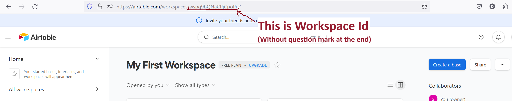

# TinderGPT 
### Your automatic dating assistant
TinderGPT automates the process of writing and arranging dates with girls on Tinder, enabling you to generate romantic meetings with almost zero effort. Your only role is to like the profiles that catch your eye. After that, TinderGPT comes into the play. It initiates a conversation with the girl, using details from her profile, continues by building an emotional bond and highlighting your attractive traits, and finishes by arranging a meeting and giving you a push-up on your phone with her number.

## Installation
While for a regular (production hehe) use it's recommended to use Raspberry Pi, or any other computer that you can leave turned on day and night, I suggest to try application first on your PC. PC installation process is simplier and doesn't requeres having Raspberry Pi, while allow you to test application and decide if you want to use it further.

### PC Installation

1. Clone repository `git clone https://github.com/GregorD1A1/TinderGPT`
2. Go to repository `cd TinderGPT`
3. Create virtual envinronment with `python -m venv env`
4. Activate envinronment with `env\Scripts\activate` on Windows or `source env/bin/activate` on Linux
5. Install dependencies `pip install -r requirements.txt`
6. Create new Firefox profile for application: 
In your Firefox browser (install Firefox if you have no) write `about:profiles` in the search field. The profile management page will open. Click "Create new profile". Proceed on profile creation window. Write name of your profile and choose profile folder to <path>/TinderGPT/driver/FirefoxProfile. Careful here - if you change profile name after choosing profile directory, it'll change you profile directory as well; so write profile name first and after it choose profile directory.

After profile is created, set up your old profile default again (it sets created profile default by default) an click "Launch profile in the new browser" under newly created profile.
7. Login to tinder. In opened window proceed to tinder.com and login to your account. Here will appear few windows asking about permission to localisation, enebling some features, ask about buying tinder gold. Close all that windows manually as TinderGPT will not manage it by it's own. Check out "messages" tab also and close windows that will appear here.
8. Change name of `.env.template` file to `.env` and open it with text editor.
9. Here we need to fullfil provided fields. After "Language" provide your language (language TinderGPT will write in) without any parenthesis. For example, in my case it looks like: `LANGUAGE=Polish`.
10. Provede your OpenAI API key from OpenAI website.
11. Airtable:
Now we need to set up Airtable to TinderGPT be available remember informations about girls. Additional plus of Airtable is that memory will be common for diifferent devices if you'll use TInderGPT on more than one computer. Go to airtable.com and create account if you have no. Go to "Developer Hub" -> "Personal access token" and create new token. Add to it all possible rights. Paste it to .env file after "AIRTABLE_TOKEN=".

After to to main page -> "All workspaces" -> click on "My first workspace". When you entered workspace, at the adress bar of your browser you'll find workspace id as shown on the image.

Paste provided id after "AIRTABLE_WORKSPACE_ID=" on `.env` file.
12. Pushbullet: Pushbullet needed to get phone notification every time TinderGPT receives contact from girl. If you just testing application for a first time, you can skip that step for now and return to it later. Go to pushbullet.com, at "My account" create access token and paste it after "PUSHBULLET_API_KEY=". Install pushbullet app on your phone and connect it with computer.
13. Now you set up! 

### PC usage

1. Open TinderGPT folder in terminal. Activate envinronment as in step for of installation.
2. Start TinderGPT using `python main.py --head`. `--head` argument means we are starting it in head mode (non-headless) to see on our screen how it perform.
3. After TinderGPT browser window will appear, on your old browser window paste `localhost:8080/start_tnd` to open tinder. Wait until it loaded.
5. Use `localhost:8080/opener` to TinderGPT send opening message to first liked girl. Advanced: You can use `localhost:8080/opener/<girl_nr>`, where instead of <girl_nr> provide nr 1-8 to open concrete girl from list.
6. When girl respond, run 'localhost:8080/respond'. TinderGPT will open first unreaded message and will continue conversation. Advanced: You can use `localhost:8080/respond/<girl_nr>`, where instead of <girl_nr> provide nr 1-8 of girl from conversations list. Useful where you accasionally clicked on girl that responded you and unreaded message sign dissapeared.
7. Happy effortless dating!

### Raspberry Pi installation
1. You need to have at least RPi 4 (maybe 3 is also ok, should be tested) with at least 4 GB of RAM.
2. Install Ubuntu desctop version. You can use Raspberry Pi Imager for this. Unfortunatelly, Firefox geckodriver don't work for Raspberry Pi OS, that's why we using Ubuntu.
3. Proceed with steps 1-7 from PC installation instruction. You'll need to connect RPi to screen or use VNC to create Firefox profile.
4. If you previosely tried application on PC, just copy '.env' file to Raspberry to work on same girls table. If not, proceed. with steps 8-12 from PC installation.
5. Now you set up!

### Raspberry Pi usage
1. Activate virtual envinronment and run `python main.py`. That will start TinderGPT in headless mode. It's recommended to start it as a process or at least use tmux library to be able to return to terminal session after it will be closed.
2. At another terminal, activate virtual envinronment and run `python scheduler.py`. That will start scheduler module, that sends automatic requests to main module everyday. It's also recommended to start it as a process or at least use tmux library to be able to return to terminal session after it will be closed.
3. Now your fully automatic process of writing to girls is set up!

## Contribution
While application is already working, there still a lot of things to improve. I'm appreciate if you want to contribute to project. 

While iproving prompts, pick-up rules knowledge file or scripts in AI_logic folder, use `localhost:8080/reload` to reload changes fast without restarting whole the application (which is time-consuming).